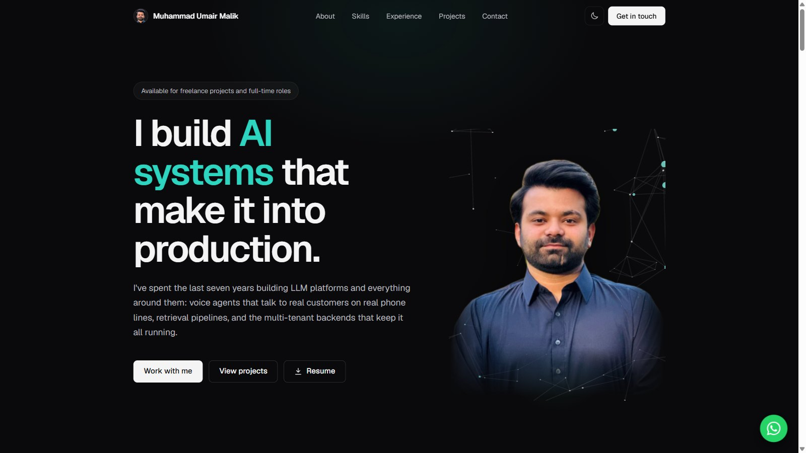

# Muhammad Umair Malik

**AI Engineer | Agentic Systems | Full-Stack Architecture**

I build AI systems that make it into production.

-585858?style=flat-square)

 

## About me

I've spent the last seven years building LLM platforms and everything around them: voice agents that talk to real customers on real phone lines, multi-agent systems, retrieval pipelines, and the multi-tenant backends that keep it all running. Currently a Senior Full-Stack AI Engineer at DevSinc.

| 7+ | 11 | <1s | 110 |
|:---:|:---:|:---:|:---:|
| years building AI systems | systems in production | voice agent turn latency | workers on one platform |

## What I work on

- Voice AI over SIP telephony (LiveKit, Gemini Live, Twilio) with sub-second responses
- Multi-agent orchestration and tool-calling design (LangChain, LangGraph, CrewAI, MCP)
- RAG pipelines with strict grounding (FAISS, Pinecone, pgvector, GraphRAG)
- LLM fine-tuning and quantization (LoRA, 4-bit and 8-bit)
- Multi-tenant SaaS architecture, event-driven backends, AI governance (NIST AI RMF, ISO 42001)

## Stack

| | |
|---|---|
| **Languages** |    |
| **AI and agents** |      |
| **Backend** |    |
| **Frontend** |     |
| **Data** |     |
| **Cloud and DevOps** |      |

## Open source on this profile

| Project | What it is |
|---|---|
| **[appointment-setter-backend](https://github.com/Umairmaliik1/appointment-setter-backend)** | Voice AI platform where agents answer and place phone calls to book appointments, over Twilio SIP with sub-second responses |
| **[appointment-setter-frontend](https://github.com/Umairmaliik1/appointment-setter-frontend)** | Tenant dashboard and apps for the Appointment Setter platform |
| **[appointment-setter-cold-caller](https://github.com/Umairmaliik1/appointment-setter-cold-caller)** | Outbound calling agent with answering machine detection, DNC lists, calling windows, and retry caps |
| **[agentic-platform](https://github.com/Umairmaliik1/agentic-platform)** | Multi-tenant platform for building and deploying custom AI agents with scoped, quota-limited API keys |
| **[multi-agent-chat](https://github.com/Umairmaliik1/multi-agent-chat)** | Multi-agent chat built around LLM orchestration |

## Production systems, private and client work

| Project | What it is |
|---|---|
| **ScholarlyHelp** | Sixteen AI writing and study tools behind one NestJS API, with a self-hosted DeBERTa model for deterministic inference |
| **South Florals Platform** | Commerce monorepo running a 10-location retail business: storefront, admin, offline POS, driver app, around 110 background workers |
| **Reggie** | Compliance platform scanning Windows fleets, with model-generated PowerShell remediation |
| **AICenturion (Cytex)** | AI trust, risk and security module: LLM firewall, DLP, prompt-injection detection, audit evidence |
| **GhostCrew.ai** | Agent framework for authorized security assessments over pentesting task trees, MCP-connected |
| **EverLearn AI** | Closed-domain assistant for oil and gas engineers, LoRA fine-tuned on proprietary field handbooks |
| **Tyllow TTS** | Neural text-to-speech with autoregressive and GAN vocoder backends and voice cloning |

---

**See the full picture at [umair-malik-ai-engineer.vercel.app](https://umair-malik-ai-engineer.vercel.app/)**

Have a project in mind, a system that needs work, or a role you're hiring for? 
[Email me](mailto:malikumair44826@gmail.com) or [message me on WhatsApp](https://wa.me/923124287874).

